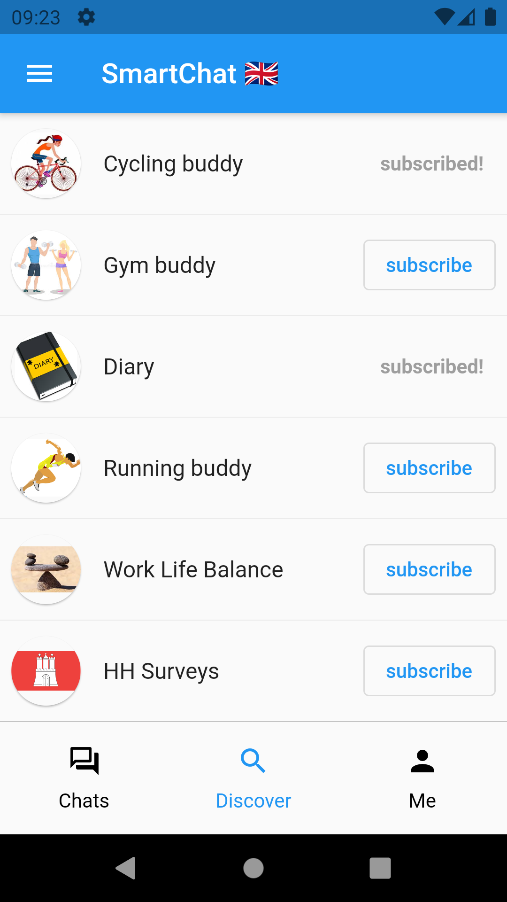
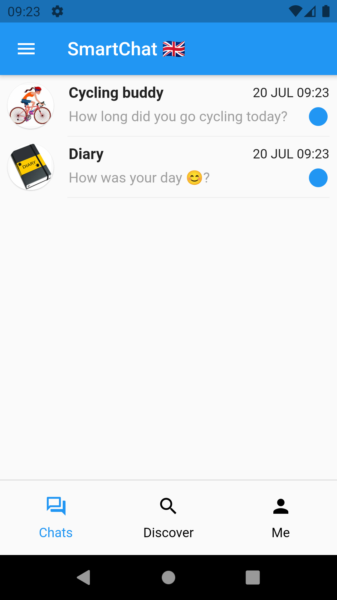
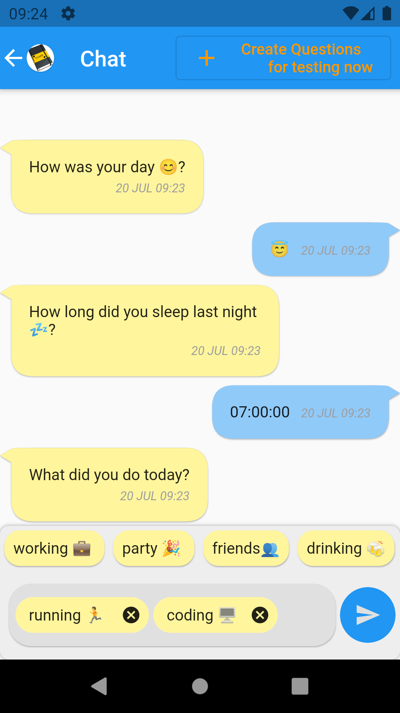
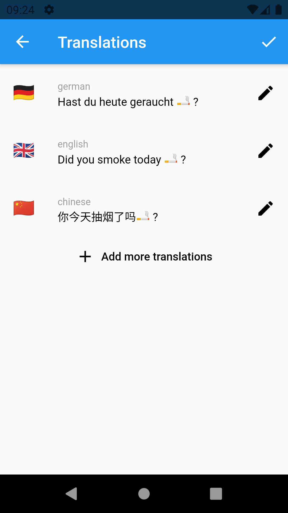
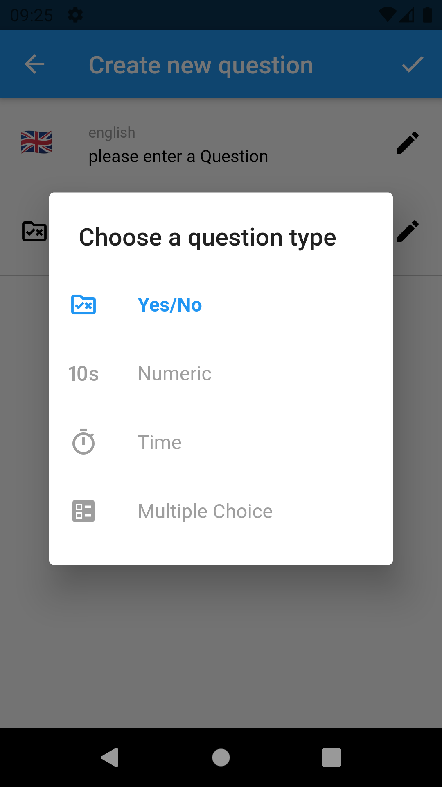
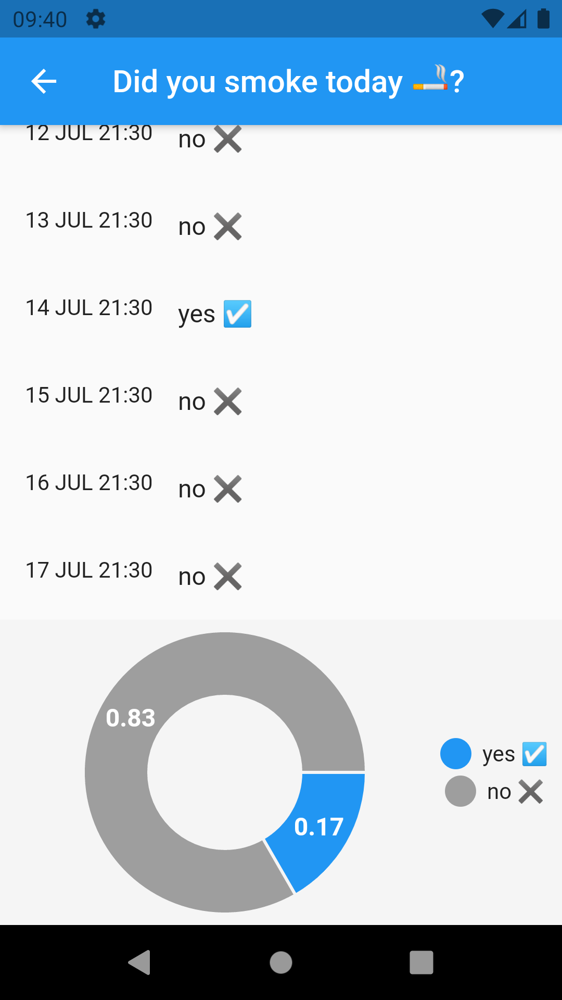

<h1>Introduction</h1>
Dear community, 
 
this is my first attempt creating a more sophisticated app (DDD, firebase, unit tests). The idea of this app is to combine a diary app, life/sports tracking app, social media app and survey app in one app. 
 
The users can create "chatbots" and fill them with questions of different types (numeric, time, multiple choice, yes/no) and share them with other users. If a user subscribes a "chatbot", the "chatbot" will ask the user its questions on a daily basis at a specific time. Any kind of question is possible: daily life-related topics like in a diary, sports-related topics, emotions etc. But also opinions could be asked via the app, e.g. political surveys etc. 
 
<h1>Features</h1>
In the current version, the "features" are still limited: 
 
-register/login with email and password, google sign-in  
-creation of chatbots, questions and pre-defined answer options in multiple languages  
-creation of daily question-items for subscribed users and sending of push-notifications (executed on the server with firebase cloud functions)  
-answering question-items in a chat with different input methods (slider, number-picker etc.)  
-edit and delete answer-items in the chat via swiping  
-simple analysis of answer statistic (listview and pie-chart for yes/no questions)  
-multi-language  
-subscribing of chatbots  
<h1>ToDo</h1>
In the long run there could be more "features" avaible:  
 
-adding/deleting friends 
-change visibility of chatbots and even answers-items (private, only friends, public) 
-more analysis options (different charts, comparing answer statistic with friends, public etc.) 
-search bar and categories for chatbots 
-change username, password etc. 
<h1>Installation</h1>
Please note that it is necessary to connect the cloned repo with an own firebase project. Otherwise it is not possible to build the project.
If you are interessted in testing the app on your device or in the emulator without doing that, please contact me. I can also provide the .apk file
<h1>Screenshots</h1>

  
   
  

  
   
  

<h1>Licence</h1>
  
Creative Commons Lizenzvertrag 
Dieses Werk ist lizenziert unter einer Creative Commons Namensnennung-Nicht kommerziell 3.0 Deutschland Lizenz. 
 
